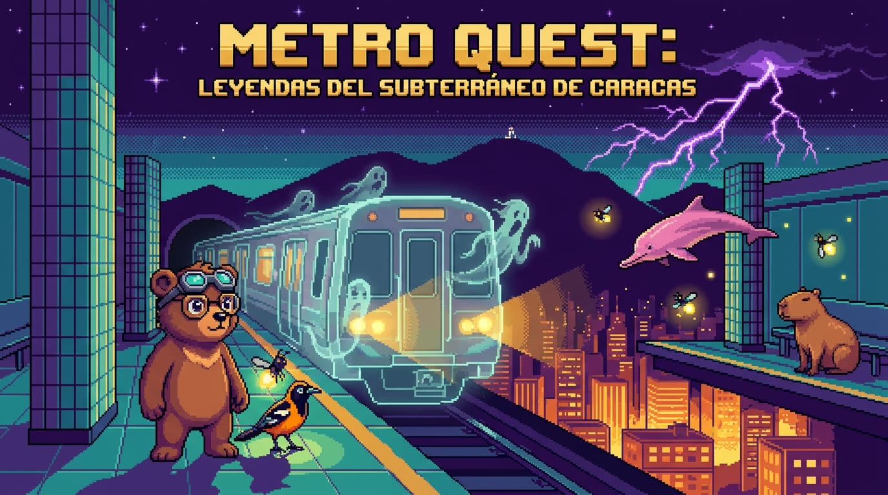

# 🚇 METRO QUEST — Leyendas del Subterráneo de Caracas



Un RPG de bolsillo estilo Pokémon ambientado en el Metro de Caracas, hecho con puro
HTML5 + Canvas + JavaScript — **cero dependencias, cero instalación**. Abre el enlace
y juega, en el teléfono o en la computadora.

> *Para los que se fueron y para los que se quedaron.*

## Cómo jugar

**Opción 1 — doble clic:** abre `index.html` en cualquier navegador moderno. Listo.

**Opción 2 — servidor local:**

```bash
python3 -m http.server 8000
# → http://localhost:8000
```

**Opción 3 — GitHub Pages:** activa Pages sobre la rama y comparte el enlace con la familia.

### Controles

| Acción | Teclado | Móvil |
|---|---|---|
| Moverse | Flechas / WASD | Cruceta |
| Aceptar / Interactuar | Z o Espacio | A |
| Cancelar | X | B |
| Menú de pausa | Enter | MENÚ |

## El juego

- Es la **hora fantasma**: pasó el último tren y la fauna de toda Venezuela —
  chigüires, toninas, osos frontinos — bajó a los túneles de la Línea 1 junto a los
  espantos del folclore. En Caracas a nadie le parece raro: se les da el asiento y ya.
- Tu abuela te da un inicial (**Frontinito** el oso de anteojos, **Turpialín** o
  **Cocuyín**) y cinco **fichas del Metro del 83**: lánzaselas a las criaturas
  salvajes para **ficharlas**. Cada una tiene su grito: el chigüire silba, el
  araguato ruge, la tonina hace clics.
- Camina los túneles de **Propatria a Petare**, vence a los **cuatro Jefes de Estación**
  por sus **Fichas Doradas**, pelea con tu primo **Cheo** (que volvió de visita después
  de cinco años afuera) y baja a la **Línea Fantasma** a enfrentar al **Tren Fantasma**,
  el que se lleva los recuerdos de la ciudad.
- 29 criaturas para fichar, 8 tipos criollos (Sabroso, Rumba, Espanto, Catatumbo,
  Caribe, Monte, Tepuy, Criollo), combate por turnos con **golpes críticos, PP por
  movimiento y estados alterados** (veneno, parálisis, sueño — el agua de coco lo cura
  todo), evoluciones, tienda de buhonero, el Doctorcito que cura, tren rápido entre
  estaciones y guardado automático en el navegador.
- Apertura cinematográfica al estilo de los clásicos (saltable con B; A activa el
  sonido) y un mapa de mecánicas + guía para extender el mundo en [DESIGN.md](DESIGN.md).

Toda la mitología del juego — de dónde sale cada criatura, cada estación y cada chiste —
está en **[LORE.md](LORE.md)**.

## Estructura

```
index.html        el juego (carga los scripts en orden)
css/style.css     marco retro + controles táctiles
js/core.js        entrada, texto, cajas de diálogo, menús
js/audio.js       chiptune procedural (WebAudio, sin archivos)
js/dex.js         tipos, movimientos y los 25 espantos (con su pixel art de respaldo)
js/sprite-manifest.js  qué sprites PNG tiene cada especie (autogenerado)
js/sprites.js     tiles + gente (procedural) y carga de los sprites 64×64 de las criaturas
assets/creatures/ sprites pintados a mano: front/back de combate, icono, overworld, tornasol
js/world.js       Línea 1 completa: estaciones, túneles, NPCs, jefes
js/battle.js      combate por turnos, fichar, experiencia, evolución
js/overworld.js   caminar, encuentros, tiendas, tren, menú de pausa
js/main.js        título, historia, guardado, final
LORE.md           la biblia del mundo
tests/smoke.js    prueba de humo (node tests/smoke.js)
```

## Pruebas

```bash
node tests/smoke.js
```

Valida la integridad de los datos (especies, movimientos, mapas, warps, conectividad a
pie de toda la red) y simula combates completos, capturas, evoluciones y los guiones de
historia de punta a punta.
